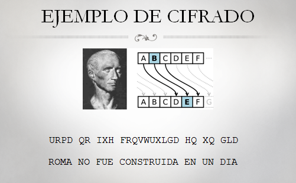
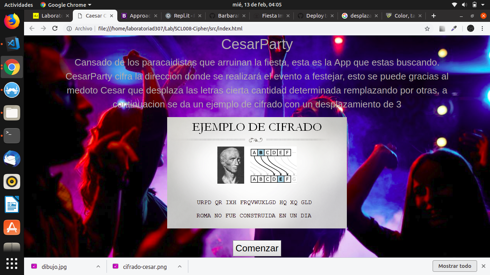
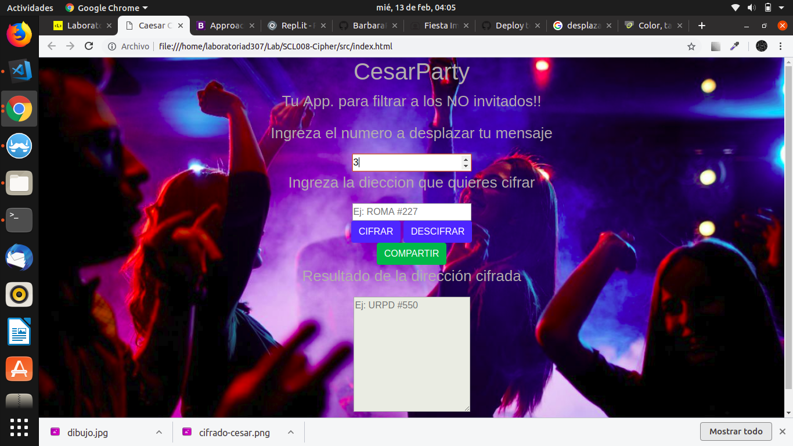

#  ¡¡¡ Bienvenido a CesarParty !!!

Si estas cansado de los NO invitados mas conocidos como paracaidistas CesarParty es tu solucción.
CesarParty es la App que estas buscando. cifra la direccion donde se realizará el evento a festejar, esto se puede gracias al medoto Cesar que desplaza las letras cierta cantidad determinada remplazando por otras, a continuacion se da un ejemplo de cifrado con un desplazamiento de 3:

# Prueba aquí ésta increíble aplicación web:
[CesarParty](https://vurles.github.io/SCL008-Cipher/src/index.html)

## Un poco de historia sobre el cifrado Cesar.

El cifrado césar es una de las técnicas más simples para cifrar un mensaje. Es un tipo de cifrado por sustitución, es decir que cada letra del texto original es reemplazada por otra que se encuentra un número fijo de posiciones (desplazamiento) más adelante en el mismo alfabeto.

- La letra A se cifra como D.
- La palabra CASA se cifra como FDVD.
- Alfabeto sin cifrar: A B C D E F G H I J K L M N O P Q R S T U V W X Y Z
- Alfabeto cifrado: D E F G H I J K L M N O P Q R S T U V W X Y Z A B C

## Diseño de experiencia de usuario
### Aquí te ayudaré a utilizar esta aplicación web:

Ingresa a la App. CesarParty.
Ingresa el número de desplazamiento que tendrá tu cifrado.
Ingresa la dirección que vas a cifrar.

 

